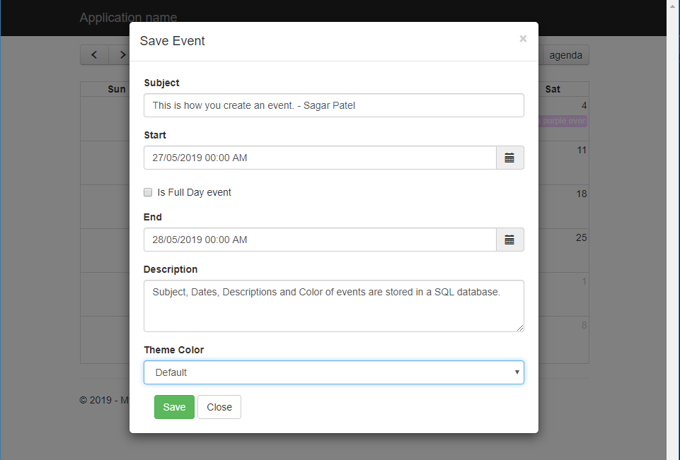
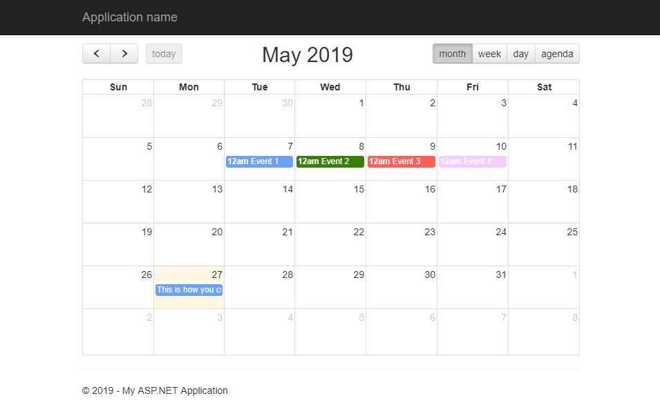
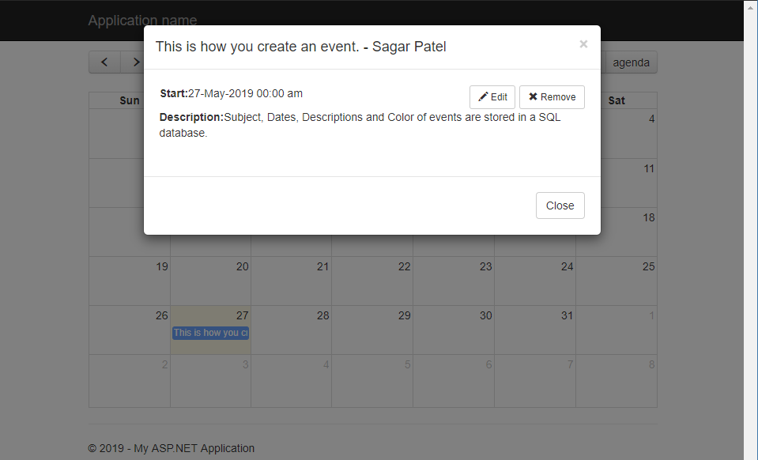

# .Net-Applications
This repository consists of Console , WPF, Web Forms, and MVC applications with back-end C#, CSS, XAML, and SQL using ASP.NET / .NET frameworks.

Each folder is catagorized by different .Net devlopemnt principles and applications. Inside these folders are numerous projects that demonstraight low to higher level of understanding and development of each section.

# MVC Calendar Event Application Screenshots.

